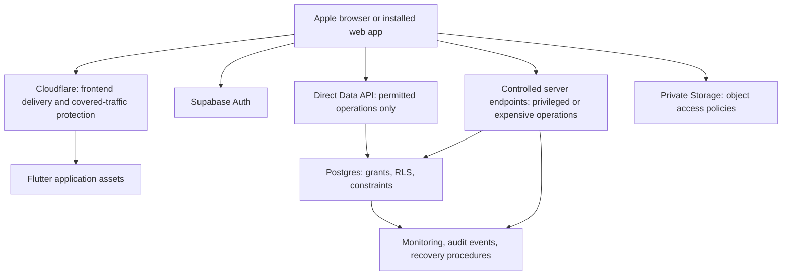

# Security System Design: Threats, Solutions, Implementation, and Interview Answers

Project: Mobile Shop SaaS — Flutter web app with Supabase

Status: Design and interview preparation, 2026-10-05. Controls below are proposed or require verification. This document does not claim they have been implemented or tested. Use “I designed / I would implement” now; use “I implemented / I verified” only after attaching actual evidence.

Related execution checklist: [Production Security Plan](production_security_plan.md).

## 1. Explain the system in 60 seconds

> “I am designing a multi-tenant mobile-shop management application using Flutter and Supabase. Each shop is a tenant, and staff access depends on their shop, branch, and action permissions. The main security requirement is that changing a URL or calling the API directly must not expose another shop's data. My design enforces authorization in the backend and database, with RLS for row isolation and validated server operations for financial changes. I also plan controls for account takeover, request abuse, file access, offline data, and recovery. Production readiness will be demonstrated through direct API tests, tenant-isolation tests, concurrency tests, and operational evidence.”

This explains the proposed design honestly. It does not imply that a finished audit has certified the app.

## 2. System design and trust boundaries



The frontend is untrusted. An attacker can inspect its code and make their own requests. Cloudflare protecting the frontend does not automatically protect direct Supabase traffic. Each reachable API must enforce its own required security controls.

Normal data operations should preserve the user's identity and database policies. Privileged endpoints should use elevated credentials only for the narrow operation that needs them, after verifying the caller. Adding a server layer does not automatically make an operation secure.

| Design question | Proposed decision | Reason and tradeoff |
| --- | --- | --- |
| Where is isolation enforced? | Database RLS plus action checks in server operations | Protects direct API access; policies and privileged bypasses require careful testing |
| How are permissions represented? | Roles map to actions; tenant, branch, account state, and entitlement add context | A role name alone cannot express object ownership or branch scope |
| Direct database API or backend? | Direct API only for reviewed, bounded operations; server endpoints for privileged/expensive workflows | Avoids unnecessary infrastructure while retaining business controls |
| Are sessions immediately revocable? | Define and enforce a server-side revocation policy on required paths | Additional checks cost latency; JWT expiry alone is not instant revocation |
| What is offline behavior? | Minimal private cache; online authorization for initial financial writes | Easier revocation and consistency, with reduced offline capability |
| Can Apple-only access prove device identity? | No; treat it as a product restriction | Browser identity can be spoofed |

## 3. Threat: changing a link to access another shop's data

**Name:** Broken Object Level Authorization (BOLA), often called IDOR.

**Attack example:** A cashier changes `/invoices/123` to `/invoices/124`, replaces `tenant_id` in a request, or calls the invoice API directly with another shop's valid ID.

**Impact:** Customer details, sales, or financial records leak; unauthorized edits may corrupt another business's records.

**Solution:** Authorize access to the actual target object using trusted identity and stored membership. An ID identifies a record; it does not authorize access.

**How I would implement it:**

1. Validate the caller's session and resolve their current account and memberships server-side.
2. Enforce RLS on exposed business tables for reads and writes.
3. Check the target record's stored tenant/branch against those memberships.
4. Check the requested action, such as invoice read, cancellation, or export.
5. Validate new ownership values during writes so an allowed row cannot be moved into another tenant.
6. Apply equivalent checks to RPCs, lists, counts, exports, files, and Realtime data.

Illustrative authorization logic, not executable SQL:

```text
allow invoice.read only when:
  verified caller exists
  AND caller is active
  AND caller belongs to invoice.tenant_id
  AND caller can access invoice.branch_id
  AND caller currently has invoice.read permission
```

**Verification:** Create tenants A and B. As A, request B's known invoice ID through the UI route and direct API; remove all tenant filters; attempt edits. Confirm no data disclosure and no state change. As the authorized B user, confirm the operation succeeds.

**Interview answer:** “I do not rely on hiding links or using UUIDs. I design authorization around the authenticated actor, the stored owner of the object, and the requested action. The same rules must hold when someone bypasses the UI.”

**Follow-up — Why not just use UUIDs?** They reduce easy guessing, but IDs can leak through logs or shared links. Ownership checks remain necessary even when the attacker already knows the ID.

## 4. Threat: a staff member becomes an owner or platform administrator

**Name:** Privilege escalation and mass assignment.

**Attack example:** A profile update includes `role: owner`, another `tenant_id`, or `subscription_active: true`. A shop owner calls a platform-admin RPC directly.

**Solution:** Restrict editable fields and authorize each administrative action server-side.

**How I would implement it:** Allowlist profile fields; restrict grants on sensitive columns; use narrowly scoped role-management RPCs; check which roles a caller is allowed to assign. Keep platform administration separate from shop ownership. Do not trust user-editable metadata for authority. Log successful and rejected privilege changes without exposing credentials.

**Verification:** Submit extra fields, invoke admin endpoints directly, and try to grant a role stronger than the caller can manage. Check stored roles and memberships remain unchanged. Test allowed staff-management flows too.

**Interview answer:** “RLS answers which rows a user can access, but field restrictions and action permissions also matter. Owning a profile must not let someone edit its authority fields.”

## 5. Threat: privileged functions bypass the normal security model

**Attack example:** A SECURITY DEFINER RPC trusts a supplied user ID, or an Edge Function uses a service-role key to fetch whichever tenant the caller requests.

**Solution:** Minimize privilege and explicitly authorize privileged operations.

**How I would implement it:** Inventory definer functions and service-role usage. Restrict execution grants, secure SQL object resolution, validate the authenticated actor and all related IDs, and use user-scoped execution wherever possible. Keep service keys on the server. Ensure old RPCs and direct table writes cannot bypass hardened operations.

Repository review targets include `supabase/functions/invite-staff/index.ts` and privileged checkout/approval SQL. Their presence is not proof of exploitation; deployed permissions and execution behavior must be audited.

**Verification:** Invoke each privileged endpoint with anonymous, low-privilege, cross-tenant, disabled, and valid callers. Exercise retries and failure cleanup. Verify no unrelated record is created, changed, or deleted.

**Interview answer:** “An elevated database function becomes part of the security boundary. I would review its grants and authorization as carefully as an external API, because normal RLS may not protect its internal operations.”

## 6. Threat: stolen accounts, brute force, and stale sessions

**Attack example:** An attacker guesses passwords or discount PINs. A removed employee replays an old access token or cached permission set.

**Solution:** Strong authentication, bounded attempts, current authorization, and an explicit session-revocation design.

**How I would implement it:** Require MFA for privileged roles, apply login/reset/PIN rate limits, use safe generic errors, and validate current account activity and membership in backend access checks. For paths requiring immediate revocation, check server-side session validity or a revocation marker. Do not assume deleting a refresh token invalidates an existing JWT immediately.

**Verification:** Replay a captured test token after role revocation, account disabling, and sign-out. Verify the promised behavior on Data API, RPC, files, and server endpoints. Test rate limits without creating a permanent lockout that attackers can trigger against victims.

**Interview answer:** “Authentication tells me who presented the request. Authorization decides what that identity may do now. An old signed token must not preserve a permission that has been removed.”

**Tradeoff:** More frequent server-side checks add cost, but are necessary when the product requires prompt revocation. Already downloaded offline data cannot be guaranteed remotely erased.

## 7. Threat: injection, malicious scripts, and cross-site requests

**Attack example:** Search input is concatenated into dynamic SQL; a product name reaches an unsafe HTML renderer; a cookie-authenticated mutation can be triggered from another website.

**Solution:** Parameterized data access, safe rendering, restricted script execution, and authentication-model-appropriate CSRF protection.

**How I would implement it:** Parameterize SQL values and allowlist dynamic identifiers such as sort columns. Review raw SQL, HTML/JS interop, third-party scripts, and uploaded active content. Deploy and test a CSP compatible with Flutter. If cookie sessions are used, configure Secure/HttpOnly/SameSite and CSRF/origin defenses. For browser-held bearer tokens, focus on token exposure and XSS; do not describe HttpOnly cookies as an existing control unless that architecture is actually implemented.

**Verification:** Exercise representative query inputs and rendered fields, confirm unauthorized scripts do not execute, and test cross-origin mutations for any cookie-backed endpoints.

**Interview answer:** “Input validation and parameterization serve different purposes. I validate business input, parameterize database queries, and ensure displayed content cannot become executable code.”

**Follow-up — Does CORS secure the API?** No. CORS limits browser behavior; scripts outside the browser can ignore it. Authentication and authorization remain mandatory.

## 8. Threat: private files or cached data leak

**Attack example:** A repair photo is in a public bucket; an attacker changes its object path; the next user on a shared device sees the previous shop's cached records.

**Solution:** Private object policies and account-scoped caching.

**How I would implement it:** Verify tenant ownership for storage reads/writes/listing/deletion. Generate safe upload paths and validate file size/content. Authorize before issuing short-lived download links. Partition local records by user and tenant; clear sensitive state on logout/account switching. Keep private responses out of shared caches.

**Verification:** Guess paths, overwrite other tenants' files, follow expired links, switch accounts, reopen the installed app offline, and use back navigation. Check app state and storage behavior separately.

**Interview answer:** “A signed URL is temporary bearer access, not proof that the person opening it is the original user. For files requiring immediate revocation, I would use authenticated access rather than depend on a long-lived signed link.”

## 9. Threat: flooding requests makes the service slow or expensive

**Name:** Denial of service and resource-exhaustion abuse.

**Attack example:** A user repeatedly requests full-history reports, submits large imports, or bypasses a gateway to call an expensive Supabase RPC directly.

**Solution:** Layered traffic protection plus application resource limits.

**How I would implement it:** Use provider DDoS controls for covered traffic. Apply durable limits by IP, account, and tenant as appropriate; cap payloads, query results, duration, and concurrent jobs. Put expensive operations behind controlled server endpoints and close or equally protect alternate direct execution paths. Index real query patterns and monitor latency, resource usage, and cost.

**Verification:** Run bounded staging tests against both the preferred route and direct origin, including authenticated abuse. Measure legitimate-user latency, rejected traffic, database load, and financial correctness. Never deliberately flood production.

**Interview answer:** “A WAF cannot decide how expensive a valid report is for my application. I would combine network protection with operation-level quotas, bounded queries, and background-job concurrency limits.”

**Tradeoff:** Very strict IP limits can block many legitimate staff sharing one connection. Limits need representative usage measurements. No design can guarantee that a provider outage or sufficiently large attack causes zero downtime.

## 10. Threat: duplicate payments, forged totals, and race conditions

**Attack example:** Double tapping checkout creates two sales; retrying a payment duplicates a ledger entry; concurrent purchases sell the same stock; a request supplies an unauthorized discount.

**Solution:** Server-side business validation, atomic transactions, idempotency, and concurrency control.

**How I would implement it:** Validate allowed prices/discounts and calculate trusted totals server-side. Write sale, stock, and accounting changes atomically. Use operation keys scoped to the tenant/action with a database uniqueness constraint. Reject the same key with a different payload; return the prior result for a valid retry. Use appropriate row locking or conditional updates for contested inventory. Protect alternate write routes too.

**Verification:** Submit identical requests concurrently, retry after a simulated lost response, change the payload while reusing a key, and compete for limited stock. Inspect ledger totals and final stock, not just HTTP responses.

**Interview answer:** “Disabling a button helps usability, but database constraints and idempotent server operations prevent duplicate financial effects. My test would simulate retries and concurrency rather than only one successful checkout.”

## 11. Threat: leaked credentials or compromised deployment accounts

**Attack example:** A service key is bundled into JavaScript or appears in a log; an attacker compromises the domain registrar or CI account.

**Solution:** Server-only secrets, least privilege, MFA, and controlled releases.

**How I would implement it:** Separate environment credentials, scan code and build artifacts, redact logs, restrict deployment access, protect DNS/domain accounts, and document rotation. A public Supabase client key is not treated as a secret; database policies still enforce access. Rehearse migrations and compare deployed policies with the reviewed version.

**Verification:** Inspect built artifacts and deployment configuration without printing secrets. Exercise a test credential rotation and verify application recovery. Confirm a low-privilege deployment identity cannot perform unrelated administration.

**Interview answer:** “Application security also depends on who can change the code, DNS, and database configuration. I include the delivery pipeline and administrator accounts in the threat model.”

## 12. Threat: data loss, outages, and an undetected incident

**Attack example:** A bad migration deletes records, storage objects disappear, or unauthorized access continues because nobody receives alerts.

**Solution:** Auditable events, monitoring, recoverable backups, and practiced response.

**How I would implement it:** Capture sensitive actions with actor/scope/result/correlation ID, restrict log access, and configure alert ownership. Back up database and required files/configuration, define acceptable data loss (RPO) and recovery time (RTO), and rehearse restoring into an isolated environment. Document containment and safe recovery without undoing security fixes.

**Verification:** Trigger a test alert, restore representative data/files, measure recovery time and recoverable data age, and check business totals after restoration.

**Interview answer:** “A backup is useful only if it can be restored within the recovery requirements. I would show measured restore evidence, not just a dashboard saying backups are enabled.”

## 13. Answer: “How did you implement and prove it?”

Until implementation, answer: “This is my proposed design. Existing security migrations are present, but I have not yet verified full coverage or the live configuration.”

After implementation, explain each control using this structure:

1. **Threat:** What could an attacker actually do?
2. **Invariant:** What must always remain true?
3. **Enforcement:** Which database policy, function, or infrastructure rule guarantees the check?
4. **Change:** Which reviewed files/configuration changed, and why?
5. **Evidence:** Which negative and positive tests passed, against which version/environment?
6. **Tradeoff:** What cost, usability impact, or residual risk remains?
7. **Operations:** How is failure detected and recovered from?

Completed-work answer template — fill only with verified facts:

> “The risk was [specific attack]. I implemented [control] in [actual component/change]. I tested it using [actors and requests], including direct API access. The unauthorized request produced [observed result], the authorized request succeeded, and I verified [database/storage state]. This was tested on [version/environment/date]. The remaining limitation is [honest limitation], monitored through [actual control].”

Keep evidence in the implementation report linked from the production plan. Do not invent test results, performance numbers, deployed settings, or penetration-test outcomes for an interview.

## 14. Likely system-design follow-up questions

| Interview question | Answer |
| --- | --- |
| Why not enforce everything in Flutter? | The caller controls the client and can bypass it. Backend/database checks protect the resource itself. |
| Is login enough? | No. A valid user may still be accessing the wrong shop, branch, object, or action. |
| Is RLS enough? | It is central for row isolation, but privileged functions, field changes, storage, abuse limits, and business invariants need separate review. |
| How do you prevent an endpoint being forgotten? | Maintain a surface inventory and access matrix, and require negative authorization tests for new surfaces. |
| What if the permission service fails? | Protected operations fail closed with a recoverable error; stale client permissions do not grant backend access. |
| What if the attacker knows the Supabase URL/key? | That is assumed. Public API reachability is protected by grants, RLS, validated functions, and abuse controls. |
| What if a shop has many branches? | Tenant isolation stays mandatory; branch access follows explicit memberships and documented tenant-wide permissions. |
| Why not a separate database per shop? | Shared storage with enforced isolation is simpler initially. Dedicated databases increase operational cost and may be considered for specific isolation requirements. |
| Can we promise 100% security? | No. We can define invariants, test attacks, review independently, monitor continuously, and block release on known bypasses. |
| How do you know it is production-ready? | Security, load, deployment, and recovery gates have actual evidence; a successful build alone does not establish readiness. |

## 15. Launch priorities

**First:** Tenant/branch/action isolation; sensitive field protection; privileged functions; private files; direct API bypass tests.

**Next:** Session revocation, financial integrity, local cache isolation, request limits, browser security, and deployment credentials.

**Before production:** Independent review, production-equivalent verification, restore exercise, alert delivery, and a limited pilot. No known authorization bypass can remain open at launch.

Mechanism references and the full execution/release checklist are in [Production Security Plan](production_security_plan.md#14-reference-guidance). This interview guide explains that plan; it does not replace implementation evidence.
